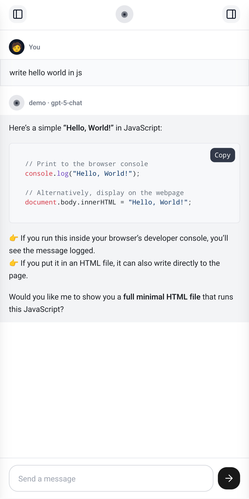
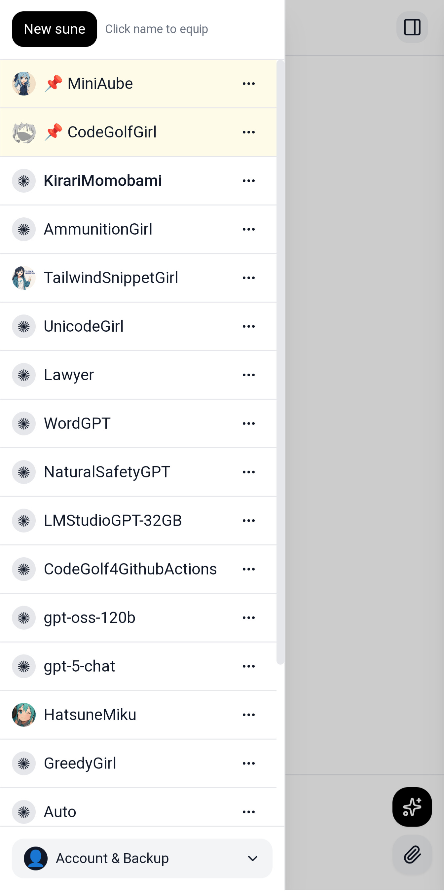
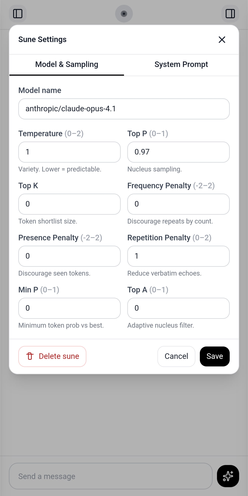
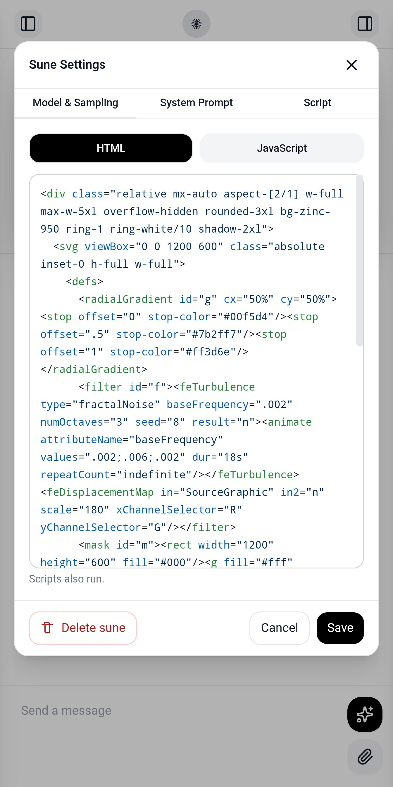
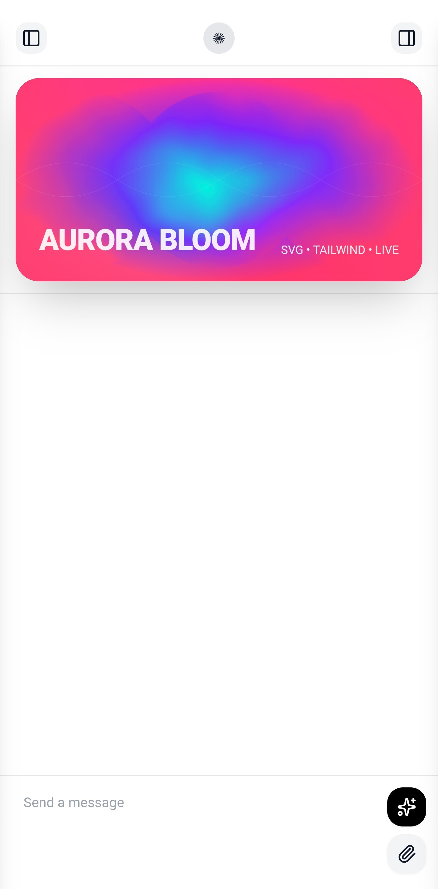

💠 New! 

You can script inside the app either to function call or extend functionality of the app almost like modding. Each sune is like a module. You can have many. And share them.

Here is an example of some HTML/JS artwork.



```
v0.3: added dedup threads functionality
v0.4: mobile keyboard bug fixes
v0.5: code highlighting only after stream
v0.6: aborting mid stream fix
v0.7: correctly remember assistant name & model
v0.8: introducing sunes
v0.9: htmx
v0.10: sune pin, rename, and pfp
v0.11: top center avatar match sune pfp
v0.12: ✺
v0.13: lucide sparkles & top_p
v0.14: vite-plugin-pwa
v0.15.1: android apk first release
v0.16: icons & removed bad tips
v0.17: reasoning effort setting
v0.18: touch ripple effect
v0.19: import/export keeps last updated
v0.20: token counting
v0.21: restyled input ui
v0.22: jpg, webp, png, gif, pdf, mp3, wav
v0.23: attachment badge bugs
v0.24: sune scripting tab 🕯️
v0.25: script tab tip
v0.26: indexeddb replaced w localforage
v0.27: removed ios styling
v0.28: downloadable attachments & file sizes
v0.29: update v0.27 was a mistake
v0.30: sune html tab
v0.31: html is functional 🌐
v0.32: sune html/js fix
v0.33: api json format update
v0.34: scroll past sune html
v0.35: ws intro
```
