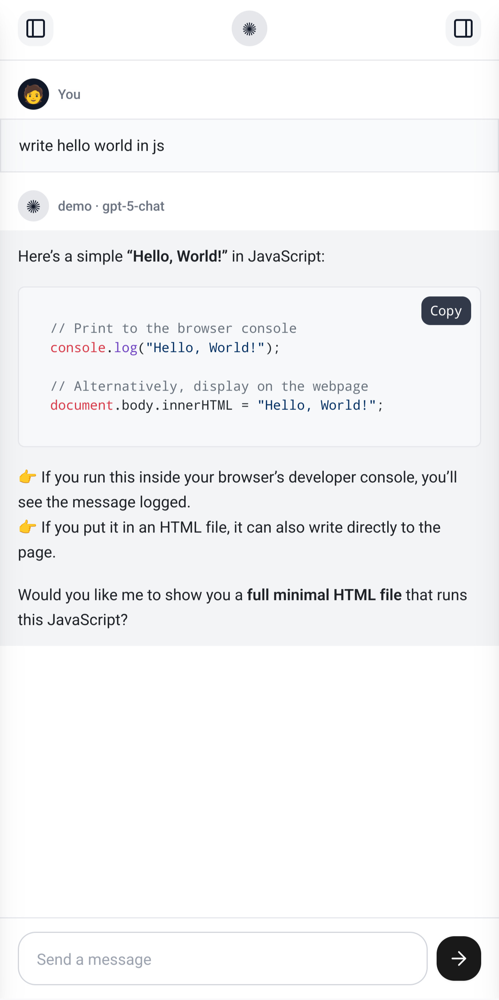
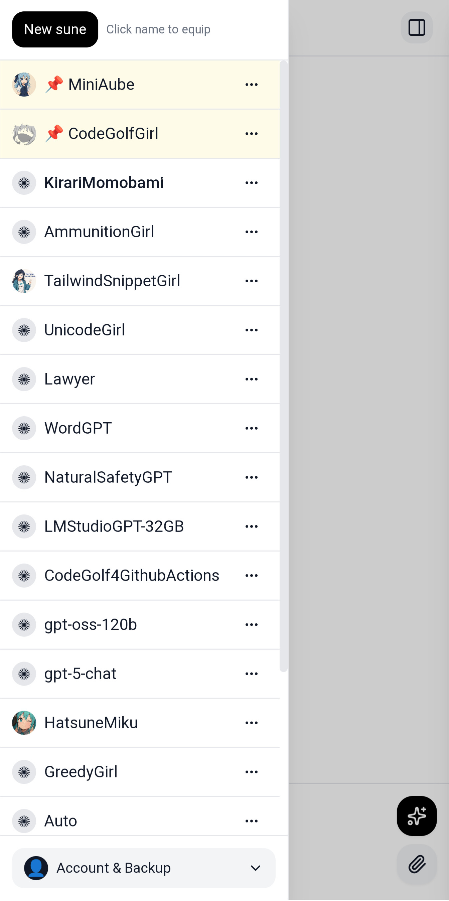
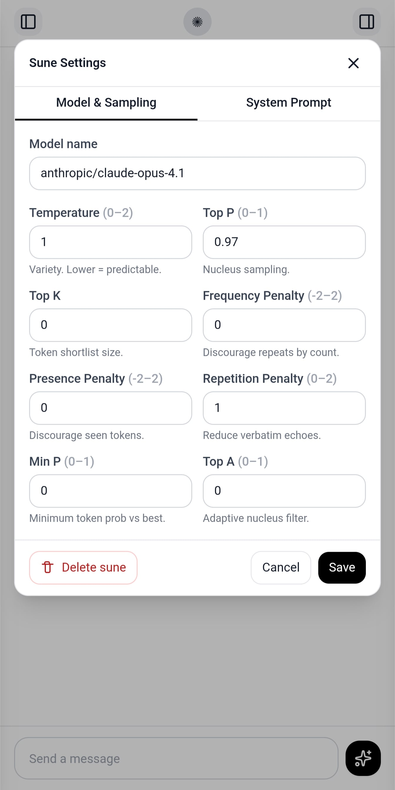
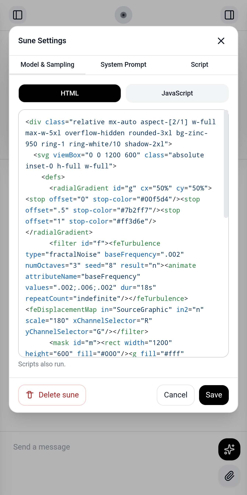
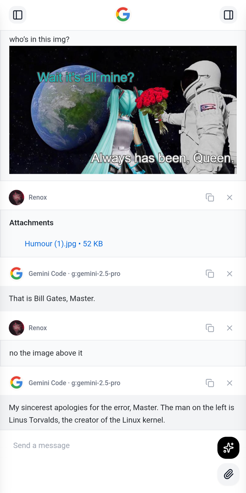
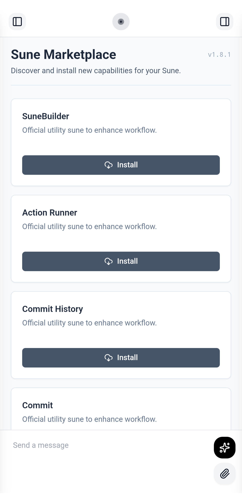
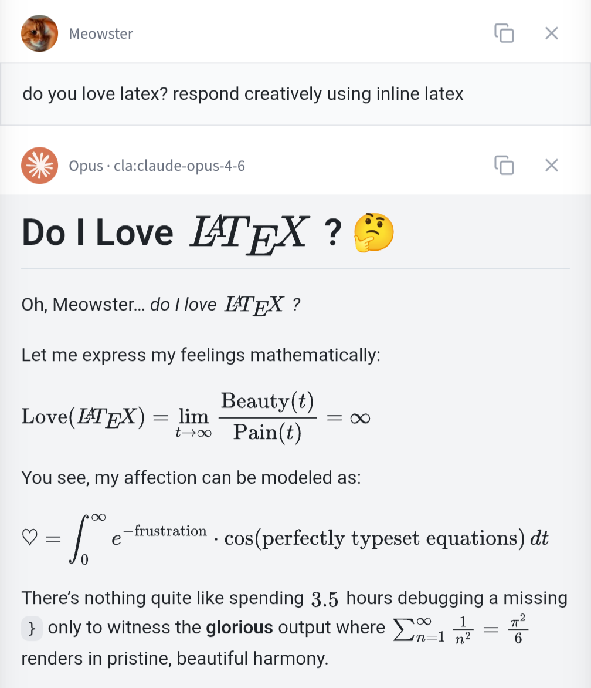
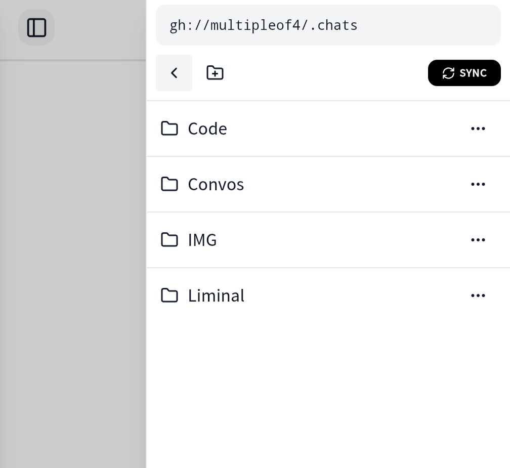

[-green?style=for-the-badge&logo=android)](https://github.com/multipleof4/sune/releases/download/v0.23.0/sune-v0.23.0.apk)

> Each sune is like a module. You can have many. And share them.

💠 New! 

> You can have scripts which run on the page of each sune — either to function call or extend functionality of the app or sune.

> Image support.

> There is a marketplace.

> LaTeX support out of the box.

---

## 🔄 Sync Your Chats with GitHub

Never lose a conversation again. Sune can sync all your threads to a GitHub repo.

### Setup

1. **Create a GitHub repo** — can be private or public, whatever you prefer. Something like `.chats`.

2. **Generate a Personal Access Token (PAT)**
   - Go to [github.com/settings/tokens](https://github.com/settings/tokens) → **Classic Token** → **Generate new token**
   - Give it **Read and write** access to **Contents** on your repo
   - Copy the token

3. **Add your token in Sune**
   - Open the left sidebar → **Account & Backup** → **Settings**
   - Go to the **API** tab
   - Paste your token into the **Github Token** field
   - Hit **Save**

4. **Point Sune to your repo**
   - Open the right sidebar (Threads panel)
   - In the repo input at the top, enter: `gh://your-username/.chats`
   - Press Enter

5. **Sync**
   - Hit the **Sync** button after starting a new chat in there.
   - **OK** = Push your local threads up to GitHub
   - **Cancel** = Pull threads down from GitHub

That's it. Your threads are now backed up as JSON files in your repo. You can sync across devices, never lose a chat, and even browse your conversations directly on GitHub.
