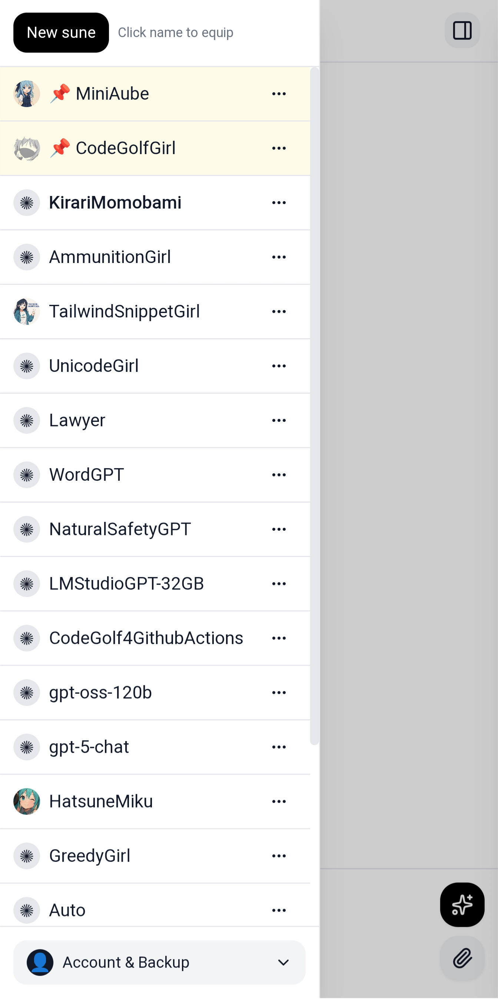

[-green?style=for-the-badge&logo=android)](https://github.com/multipleof4/sune/releases/download/v0.23.0/sune-v0.23.0.apk)

> Each sune is like a module. You can have many. And share them.

💠 New! 

> You can have scripts which run on the page of each sune — either to function call or extend functionality of the app or sune.

> There are some bugs.

> There is a marketplace.

